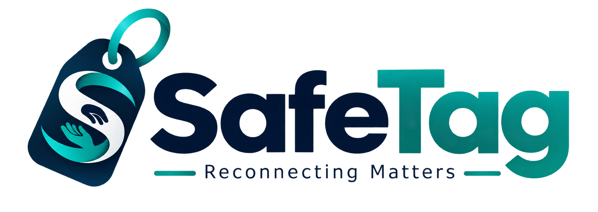
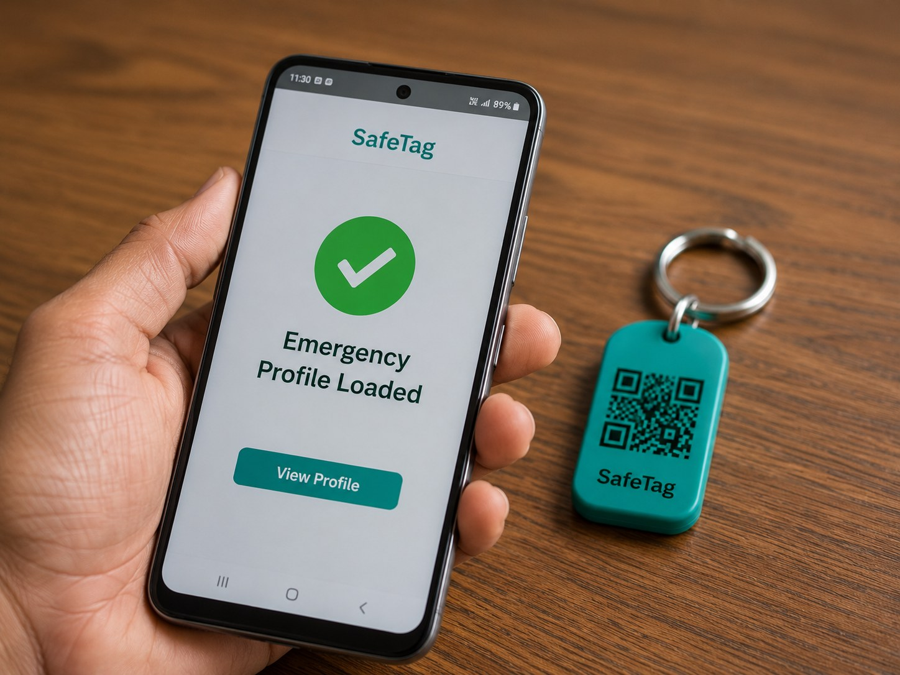
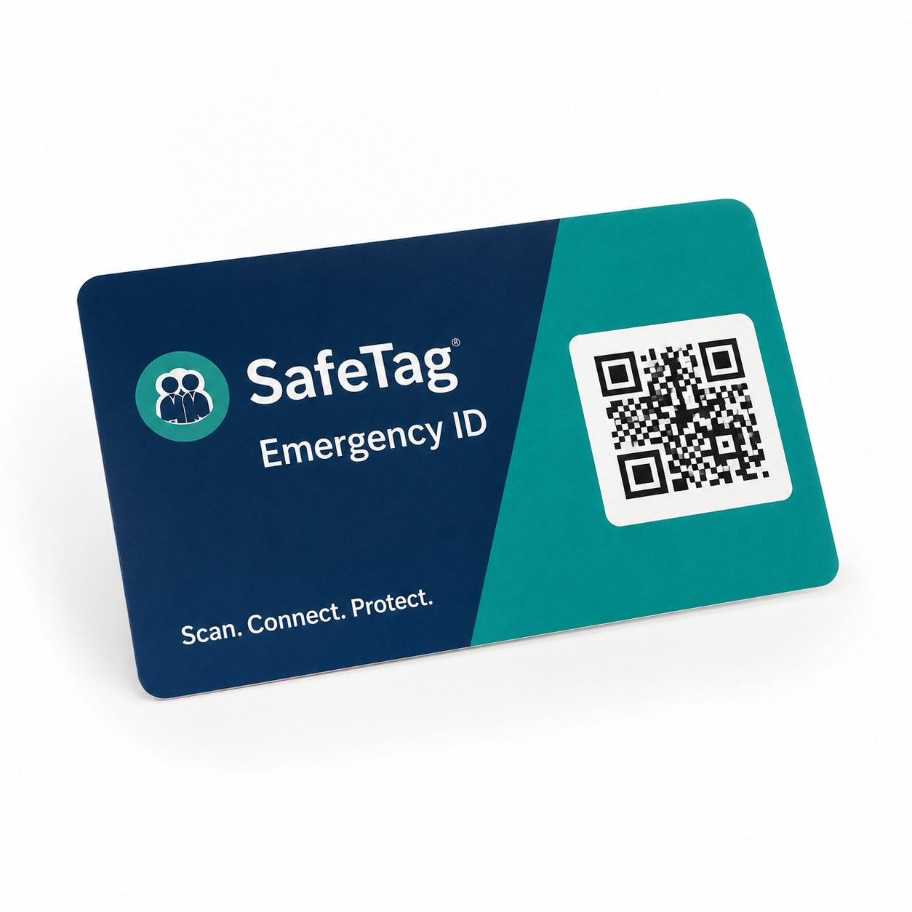

<div align="center">
  
  <h1>SafeTag</h1>
  <p><strong>Scan. Know. Save a Life.</strong></p>
  <p>India's first QR + NFC emergency identity tag platform — one scan opens a full emergency profile in under 3 seconds, no app required.</p>

  [](https://nodejs.org)
  [](https://expressjs.com)
  [](https://www.prisma.io)
  [](https://tailwindcss.com)
  [](LICENSE)
</div>

---

## What is SafeTag?

SafeTag is an emergency ID platform for India. Each tag (QR sticker, wristband, keychain, or RFID) is linked to a user's medical profile — blood group, allergies, emergency contacts, address, and more. When a bystander or first responder scans the tag, they instantly see everything they need to act. No login. No app. Works offline on any phone camera.

<div align="center">
  
</div>

---

## Features

| | Feature |
|---|---|
| 🏷️ | **Instant emergency page** — scan any QR and get name, blood group, contacts in < 3 s |
| 📱 | **No app needed** — works on any camera-equipped phone, no install |
| 🏥 | **Full medical profile** — allergies, conditions, medications, doctor contact |
| 🛒 | **Built-in store** — customers buy tags (stickers, keychains, wristbands) directly |
| 🏭 | **Manufacturer portal** — bulk batch generation, listing management |
| 👑 | **Admin dashboard** — user management, order tracking, store approval |
| 💳 | **Razorpay + COD** — UPI, card, and cash-on-delivery supported |
| 🌙 | **Dark mode** — system preference aware, flash-free IIFE toggle |
| 🔒 | **CSRF protected** — every state-changing form uses a CSRF token |
| 📊 | **QR download** — customers can download their tag QR as PNG |

---

## Screenshots

<table>
  <tr>
    <td align="center">
      <br/>
      <sub><b>Homepage</b></sub>
    </td>
    <td align="center">
      <br/>
      <sub><b>Store</b></sub>
    </td>
  </tr>
  <tr>
    <td align="center">
      <br/>
      <sub><b>Emergency Profile (child)</b></sub>
    </td>
    <td align="center">
      <br/>
      <sub><b>Emergency Profile (elderly)</b></sub>
    </td>
  </tr>
</table>

### Use Cases

<table>
  <tr>
    <td align="center"><br/><sub>Athletes</sub></td>
    <td align="center"><br/><sub>Pets</sub></td>
    <td align="center"><br/><sub>Travelers</sub></td>
    <td align="center"><br/><sub>School Kids</sub></td>
  </tr>
</table>

---

## Architecture

```
Browser (EJS + Tailwind CDN)
  ↕  HTTP / form POST
Node.js + Express (single process)
  ↕
Prisma ORM v5
  ↕
SQLite (dev)  ·  PostgreSQL (production)
```

Single process: routing, auth, admin, manufacturer, store, and tag handling all live in `server.js`. No microservices, no separate API layer.

---

## Repository Layout

```
/
├── server.js                   All routes (auth, admin, manufacturer, store, tags)
├── lib/
│   ├── db.js                   Prisma client singleton
│   └── helpers.js              Formatters, validators, ID generators
├── views/
│   ├── layout/                 _head.ejs, _foot.ejs, _navbar.ejs, _csrf.ejs
│   ├── auth/                   login.ejs, register.ejs
│   ├── manufacturer/           Portal pages
│   ├── admin/                  Admin dashboard pages
│   └── *.ejs                   index, store, emergency, dashboard, checkout, …
├── public/
│   ├── css/safetag.css
│   └── images/                 Product photos, review avatars, use-case images
├── prisma/
│   ├── schema.prisma           7-model data schema
│   ├── seed.js                 Dev seed (users, tags, products)
│   └── migrations/
├── .env.example
└── package.json
```

---

## Quick Start

### 1. Clone and install

```bash
git clone https://github.com/kumarnitish378/safe-tag.git
cd safe-tag
npm install
```

### 2. Configure environment

```bash
# Windows
copy .env.example .env

# macOS / Linux
cp .env.example .env
```

Key environment variables:

| Variable | Default | Notes |
|---|---|---|
| `NODE_SESSION_SECRET` | *(set a 64-char hex string)* | Any random string works for dev |
| `DATABASE_URL` | `file:./prisma/dev.db` | SQLite file path |
| `PORT` | `3000` | |
| `BASE_URL` | `http://localhost:3000` | Must match the domain in production |
| `DUMMY_PAYMENT` | `true` | Skip Razorpay for local dev |
| `RAZORPAY_KEY_ID` | — | Required when `DUMMY_PAYMENT=false` |
| `RAZORPAY_KEY_SECRET` | — | Required when `DUMMY_PAYMENT=false` |

### 3. Create database and seed

```bash
npx prisma migrate dev --name init
```

This creates `prisma/dev.db`, applies the schema, and auto-runs the seed script.

To re-seed without migrating:

```bash
npx prisma db seed
```

### 4. Start the server

```bash
npm start
```

Open **http://localhost:3000**

---

## Test Credentials

| Role | Email | Password |
|---|---|---|
| Admin | `admin@test.com` | `Admin@1234` |
| Customer | `customer@test.com` | `Test@1234` |
| Manufacturer | `mfr@test.com` | `Test@1234` |

### Test Tags

| Tag ID | Security Key | State |
|---|---|---|
| `TESTACT1` | `testkey00001` | Active — full profile (Ravi Kumar, O+) |
| `TESTINAC` | `testkey00002` | Inactive — triggers registration flow |

Scan URLs:
- Active tag: `http://localhost:3000/TESTACT1/testkey00001`
- Inactive tag: `http://localhost:3000/TESTINAC/testkey00002`

---

## Key URLs

### Public

| URL | Page |
|---|---|
| `/` | Homepage |
| `/store` | Product store |
| `/store/:id` | Product detail |
| `/:tag_id/:security_key` | Tag scan → emergency or registration |
| `/emergency/:tag_id` | Emergency profile (direct link) |

### Customer

| URL | Page |
|---|---|
| `/login` | Sign in |
| `/register` | Sign up |
| `/dashboard` | My tags + orders |
| `/orders` | Order history |
| `/account` | Account settings |
| `/profile/edit/:tag_id` | Edit emergency profile |

### Manufacturer

| URL | Page |
|---|---|
| `/manufacturer/login` | Manufacturer sign in |
| `/manufacturer/register` | Register as manufacturer |
| `/manufacturer/dashboard` | Batches + listings overview |
| `/manufacturer/batches/new` | Create a new tag batch |
| `/manufacturer/listings` | Manage product listings |

### Admin

| URL | Page |
|---|---|
| `/admin` | Admin dashboard |
| `/admin/users` | Manage all users |
| `/admin/manufacturers` | Approve / block manufacturers |
| `/admin/store` | Approve / feature product listings |
| `/admin/orders` | View and update all orders |

---

## Database Models

| Model | Table | Purpose |
|---|---|---|
| `Tag` | `tags` | Physical tag records (QR/NFC) |
| `MedicalProfile` | `medical_profiles` | Emergency info linked to a tag |
| `User` | `users` | Customer accounts |
| `Manufacturer` | `manufacturers` | Manufacturer accounts + approval state |
| `TagBatch` | `tag_batches` | Groups of tags produced together |
| `ProductListing` | `product_listings` | Store products (price, stock, category) |
| `Order` | `orders` | Customer purchase records |

### Prisma Studio (visual DB browser)

```bash
npm run db:studio
# opens http://localhost:5555
```

### Reset and re-seed from scratch

```bash
# Windows
Remove-Item prisma\dev.db -ErrorAction SilentlyContinue
npx prisma migrate dev --name init

# macOS / Linux
rm -f prisma/dev.db
npx prisma migrate dev --name init
```

---

## Payment

`DUMMY_PAYMENT=true` (default) skips Razorpay and confirms orders immediately — useful for local development and testing.

Set `DUMMY_PAYMENT=false` and supply `RAZORPAY_KEY_ID` + `RAZORPAY_KEY_SECRET` to enable real UPI / card / netbanking payments.

COD orders (Cash on Delivery) are always accepted regardless of the payment mode setting.

---

## Deployment (Render.com)

| Setting | Value |
|---|---|
| Environment | Node |
| Build command | `npm install && npx prisma migrate deploy` |
| Start command | `node server.js` |
| Root directory | `/` (project root) |

Switch `DATABASE_URL` to a PostgreSQL connection string in the Render environment dashboard.

### Pre-launch checklist

- [ ] `DUMMY_PAYMENT=false` and Razorpay keys configured
- [ ] `NODE_SESSION_SECRET` set to a random 64-char hex string
- [ ] `NODE_ENV=production`
- [ ] `BASE_URL` set to the live domain (e.g. `https://safe-tag.in`)
- [ ] `npx prisma migrate deploy` run against the production DB
- [ ] Test tags removed from production DB
- [ ] Domain points to Render, SSL certificate active
- [ ] SMTP credentials configured for order emails

---

## Tag Activation Flow

```
1. Customer buys tag in the store (Order created)
2. Tag manufactured & shipped to customer
3. Customer receives physical tag
4. Customer scans the QR code on the tag with any phone camera
5. Browser opens /register-tag → customer logs in / registers
6. Customer fills in their emergency profile
7. Tag is now ACTIVE — emergency page goes live at /<tag_id>
```

The dashboard shows both orders (delivery status) and activated tags side by side.

---

<div align="center">
  
  <br/><br/>
  <strong>SafeTag — Scan. Know. Save a Life.</strong><br/>
  <sub>Built with ❤️ for India · SDD v3.0</sub>
</div>
